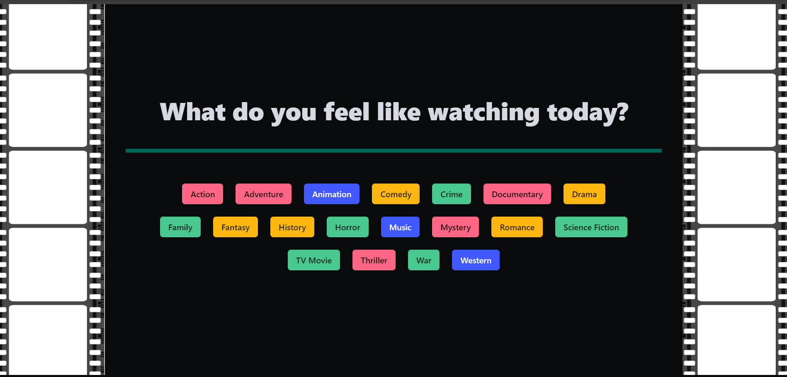

# Das Wohnzimmer by Les Lumières
Project 1 from TDM-VIRT-FSF-PT-03-2024-U-LOLC-MTTH Coding Bootcamp, developed by Yordano Pérez, Gabriela Siu and Dalia Gómez.

## Description
Das Wohnzimmer has been created to provide film enthusiasts with a platform to explore a selection of films to watch, offering the user the most relevant information about the film (e.g. synopsis, movie trailer and rating). The user also has the opportunity to input a review of his/her own, which will be appended to the information page of the movie for which the review has been made.

## Links
- URL of the GitHub repository that contains the code: https://github.com/yordanop/atoms-await-lizard
- URL of the deployed application: yordanop.github.io/atoms-await-lizard 

## Usage
This website offers users with a menu of movie genres, from which users can choose the one that they prefer. Once that an option has been selected, the user will be taken to a second page (Movie_Cards) where he/she will see a Wohnzimmer selection of movies from that genre. After this, the user will be able to click over a movie poster of the movie he/she is interested in, which will result in a famous "Wow" audio from Owen Wilson to be played, and will take the user to a third page (Movie_Trailer_Info), in which the information from that movie will be shown. This information includes: movie title, movie trailer, synopsis, rating and a button that will take the user to a modal, in which he/she will be able to input his/her own review for that particular movie. Once that the user has submitted his/her review, this review will be displayed in the "Movie_Trailer_Info" page of that particular movie. All posts that have been made for that movie will be displayed in the "Movie_Trailer_Info page" of that movie.

## Credits
Modules 1-6 from Bootcamp TDM-VIRT-FSF-PT-03-2024-U-LOLC-MTTH. Special thanks to our instructor Chris Stallcup and TA Brittani Court for the support and advice provided. The page has been designed, structured and developed by Yordano Pérez, Gabriela Siu and Dalia Gómez.

## License
MIT License used for this repository.

## Screenshots

 